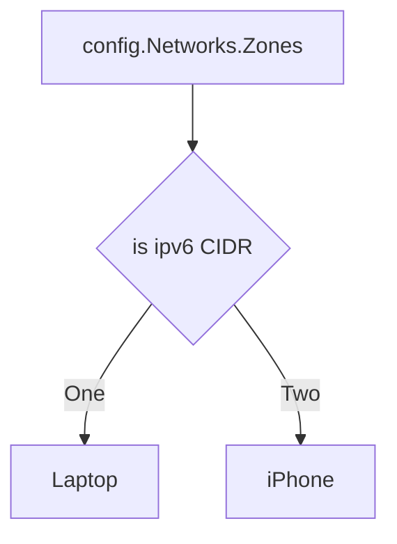

# Network

The network consists of the components VPC, Subnets, internet gateways and Elastic IPs, DHCP options, 
routing tables, gateway endpoints, security groups EC2 key pairs, IAM roles, and IAM instance profiles.
For reference, see [more detailed docs]()

## Network types

### IPv4

Just configure a IPv4 cidr for `provider.infrastructureConfig.networks.vpc.cidr`
The field `networking.ipFamilies` should only contain the `IPv4` entry.

### IPv4 with IPv4/IPv6 stack Ingress (to allow IPv6 traffic)

To enable dualStack set `provider.infrastructureConfig.dualStack.enabled` and
`provider.controlPlaneConfig.loadBalancerController.enabled` to true.

### DualStack

The field `networking.ipFamilies` should contain the two entries `IPv4` and `IPv6`.

### IPv6

We still need to configure a IPv4 cidr in `provider.infrastructureConfig.networks.vpc.cidr` since there is no IPv6-only VPC.
Set `IPv6` as entry in `networking.ipFamilies`.

## DHCP options

DHCP options are a set of configuration settings that control how your instances 
inside a VPC get their network settings automatically when they boot up.
The AWS extension creates a DHCP options set for the keys `domain-name`and `domain-name-servers`.
`domain-name-servers` is hardcoded to `AmazonProvidedDNS`.

## Security groups

We ensure that for the provider extension managed VPC it's default security group has no rules.

We also create a custom security group called SHOOT_NAME-nodes.
This security group is used for the shoot worker nodes and allows all traffic from 
the shoot worker nodes to the internet.
Depending on if the shoots IpFamilies contains IPv6 or not, the security group will create rules 
to allow only IPv4 or also IPv6 traffic.

## VPC

The VPC is the virtual private cloud that contains all the subnets and the internet gateway.
The extension will create a VPC based on `provider.infrastructureConfig.networks.vpc.cidr`.
Alternative users can bring their own VPC by setting `provider.infrastructureConfig.networks.vpc.id`.
The given VPC must enable DNC support (see usage guide).
In IPv6 and IPv4/IPv6 cluster the VPC gets a IPv6 CIDR block assigned.

## Internet Gateway

The internet gateway is used to allow instances in the VPC to connect to the internet.
For gardener managed VPCs we create an internet gateway and attach it to the VPC.

If your shoot config IpFamilies contains IPv6 an egress-only internet gateway for the gardener managed VPC is created. 
An egress-only internet gateway is used to enable outbound communication over IPv6 from instances in 
your VPC to the internet, and prevents hosts outside your VPC from initiating an IPv6 connection with your instance.

## Subnets

TODO ensure zones

* The `internal` subnet is used for **internal AWS load balancers**.
* The `public` subnet is used for **public AWS load balancers**.
* The `workers` subnet is used for all shoot worker nodes, i.e., VMs which later run your applications.

## NAT Gateways

The AWS extension creates a dedicated NAT gateway for each zone.
By default, it also creates a corresponding Elastic IP that it 
attaches to this NAT gateway and which is used for egress traffic.
You can bring your own elastic IP by defining `provider.infrastructureConfig.networks.zones.elasticIPAllocationID`.

## Gateway Endpoints

Gateway endpoints are used to connect to AWS services without going over the internet (e.g. s3).
They are connected to the VPC.

## Main Route Table

The main route table contain routes to allow all IPv4 traffic from the VPC to the internet gateway.
If a IPv6 CIDR is configured, the main route table will also contain a route to allow all IPv6 
from the VPC to the internet gateway.
